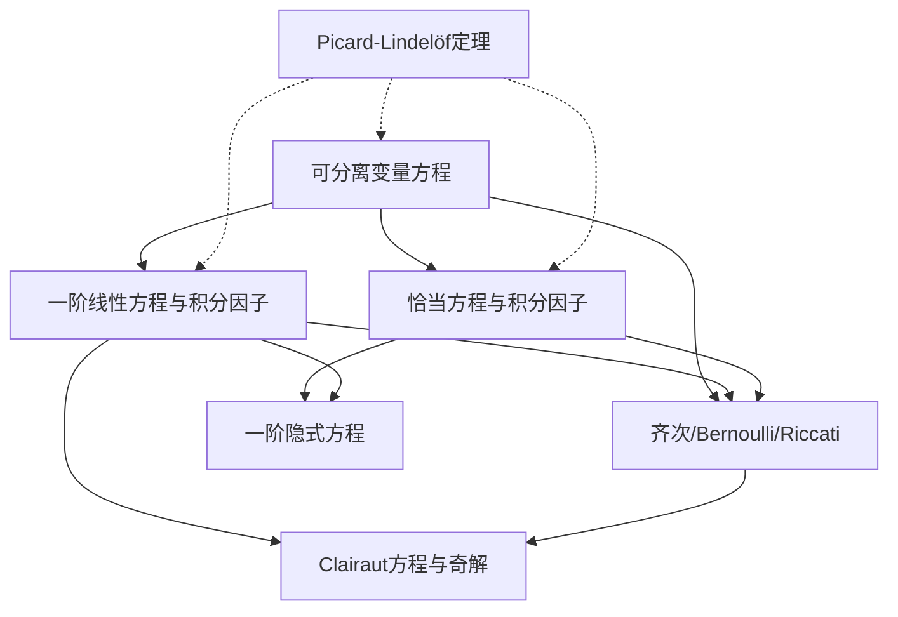

# 初等解法索引

一阶常微分方程的初等积分法。自上而下按"可直接积 → 需代换 → 有奇解"递进。

## 方法笔记 → 例题对照

| 方法笔记（Mode A） | 配套例题（Mode B） | 核心技巧 |
|---|---|---|
| [[可分离变量方程]] | [[可分离变量方程例题]] | 分离 $dy/g(y) = f(x)dx$，注意丢解 |
| [[一阶线性方程与积分因子]] | [[一阶线性方程例题]] | $\mu = e^{\int P}$，$(\mu y)' = \mu Q$ |
| [[恰当方程与积分因子]] | [[恰当方程例题]] | $M_y = N_x$，势函数 $F$ |
| [[齐次方程、Bernoulli方程与Riccati方程]] | [[Bernoulli方程例题]] | 三类代换：$v=y/x$、$v=y^{1-n}$、$y=y_1+1/u$ |

## 补充专题

| 笔记 | 内容 |
|---|---|
| [[Clairaut方程与奇解]] | $y = xy' + f(y')$ — 奇解作为包络 |
| [[一阶隐式方程的参数法]] | $F(x, y, y')=0$ 的参数化降阶 |

## 依赖地图

实线箭头 = "方法 B 的推导依赖方法 A"。虚线箭头 = "存在唯一性保证该方法的合法性"。

## 阅读路线

- **基础路线**：可分离 → 一阶线性 → 恰当方程 → 齐次/Bernoulli/Riccati
- **补充路线**：Clairaut（奇解专题） → 隐式方程（参数法专题）
- **理论锚点**：所有方法的合法性最终追溯到 [[Picard-Lindelöf定理]] 和 [[Peano存在定理]]

## 与后续阶段的衔接

- 一阶线性方程的"齐次解 + 特解"结构 → [[常数变易法]]、[[待定系数法]]（高阶线性方程）
- 积分因子思想 → [[两点边值问题与Green函数构造]]（Green 函数 = 边值问题的积分核）
- Bernoulli → Riccati → 二阶线性方程 的对应 → [[正则奇点与Frobenius方法]]（奇点分类视角）
