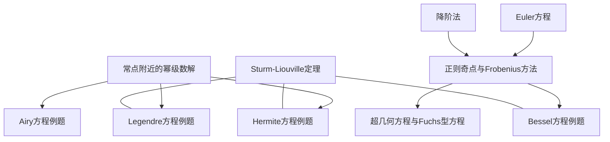

# 级数解法索引

变系数线性 ODE 的幂级数与 Frobenius 级数解法。桥接初等积分法（仅对特殊系数有效）与定性理论（不依赖闭形式解）之间的"中间地带"——当系数解析但无法初等积分时。

## 方法笔记 → 例题对照

| 方法笔记（Mode A） | 配套例题（Mode B） | 适用条件 |
|---|---|---|
| [[常点附近的幂级数解]] | [[Airy方程的幂级数解]] | $p, q$ 在 $x_0$ 附近解析 |
| [[正则奇点与Frobenius方法]] | [[Bessel方程的Frobenius解]] | $x_0$ 为正则奇点（$x p, x^2 q$ 解析） |

## 补充专题

| 笔记 | 类型 | 内容 |
|---|---|---|
| [[Legendre方程的幂级数解]] | Mode B | $x=0$ 常点展开，收敛半径与奇点的精确对应 |
| [[Hermite方程的级数解]] | Mode B | 本征值截断 ⇒ Hermite 多项式 ⇒ 量子谐振子 |
| [[超几何方程与Fuchs型方程]] | Mode A | 三个正则奇点（$0, 1, \infty$）的 Fuchs 型统一理论 |

## 依赖地图

## 阅读路线

- **入门路线**：常点幂级数解 → Airy 例题（最简单：系数为多项式，收敛半径 $\infty$）
- **经典路线**：正则奇点/Frobenius → Bessel 例题 → 超几何/Fuchs 统一理论
- **物理路线**：Legendre 例题 → Hermite 例题 → Sturm-Liouville 本征值问题
- **理论路线**：Frobenius 的完备分类 → Fuchs 型方程（三个正则奇点） → Riemann $P$-符号

## 与已有理论的衔接

- [[Sturm-Liouville定理]] — Legendre、Hermite、Bessel 方程的本征值截断均对应 SL 边值问题
- [[Euler方程]] — Frobenius 指标方程 $r(r-1) + p_0 r + q_0 = 0$ 在常系数极限下的 Euler 特例
- [[降阶法]] — Frobenius 第二情形（根差整数）中第二解的构造等价于降阶法
- [[Sturm分离定理]] — Bessel 函数零点的交叠性质（$J_\nu$ 与 $J_{\nu+1}$ 零点交替）
- [[Laplace变换解常系数线性ODE]] — 级数解与 Laplace 逆变换的渐近展开在 $x \to \infty$ 处的对偶
