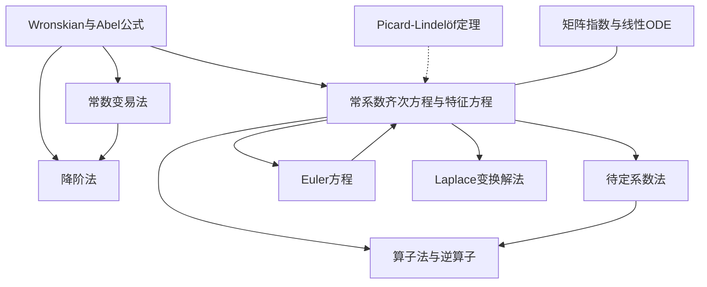

# 高阶线性方程索引

$n$ 阶线性 ODE 的构造性解法，聚焦**常系数**与**可化为常系数**的情形，承接 [[线性系统/|线性系统理论]] 并降维到标量层面的具体求解。

## 方法笔记 → 例题对照

| 方法笔记（Mode A） | 配套例题（Mode B） | 适用情形 |
|---|---|---|
| [[常系数齐次线性方程与特征方程]] | [[三阶常系数齐次方程例题]] | $y^{(n)} + \sum a_k y^{(k)} = 0$，$a_k$ 常数 |
| [[待定系数法]] | [[待定系数法例题]] | 右端为 $e^{\alpha x} P_m(x) \{\cos, \sin\}\beta x$ |
| [[常数变易法]] | [[常数变易法例题]] | 任意连续的 $g(x)$（尤其待定系数法失效时） |
| [[Euler方程]] | [[Euler方程例题]] | $x^n y^{(n)} + \cdots = 0$（等维度） |
| [[降阶法]] | [[降阶法例题]] | 已知一解求第二解 |

## 补充专题

| 笔记 | 内容 |
|---|---|
| [[Laplace变换解常系数线性ODE]] | 脉冲/间断强迫的 Laplace 变换法 |
| [[算子法与逆算子分解]] | $1/p(D)$ 的部分分式展开与指数平移定理 |

## 依赖地图

## 阅读路线

- **基本路线**：Wronskian/Abel（先修） → 常系数齐次 + 特征方程 → 待定系数法 → 常数变易法
- **变系数通道**：Euler 方程 → 降阶法
- **算子视角**：算子法与逆算子分解（统一常系数情形）
- **工程衔接**：Laplace 变换解法 → [[积分变换与信号处理/]]

## 与已有理论模块的衔接

- [[Wronskian与Abel公式]] — 所有方法的 Wronskian 非零前提，降阶公式与 Abel 公式的内在一致性
- [[矩阵指数与线性ODE]] — 特征方程 ⇔ 友矩阵的特征多项式；Jordan 块 ⇔ 重根产生 $x^k e^{rx}$
- [[Liouville公式]] — 常数变易法中 $\Phi^{-1}(t)$ 的行列式 = $1/W(t)$ 的高维推广
- [[Floquet定理]] — 周期系数线性系统的"广义特征方程"，与常系数特征方程对偶
